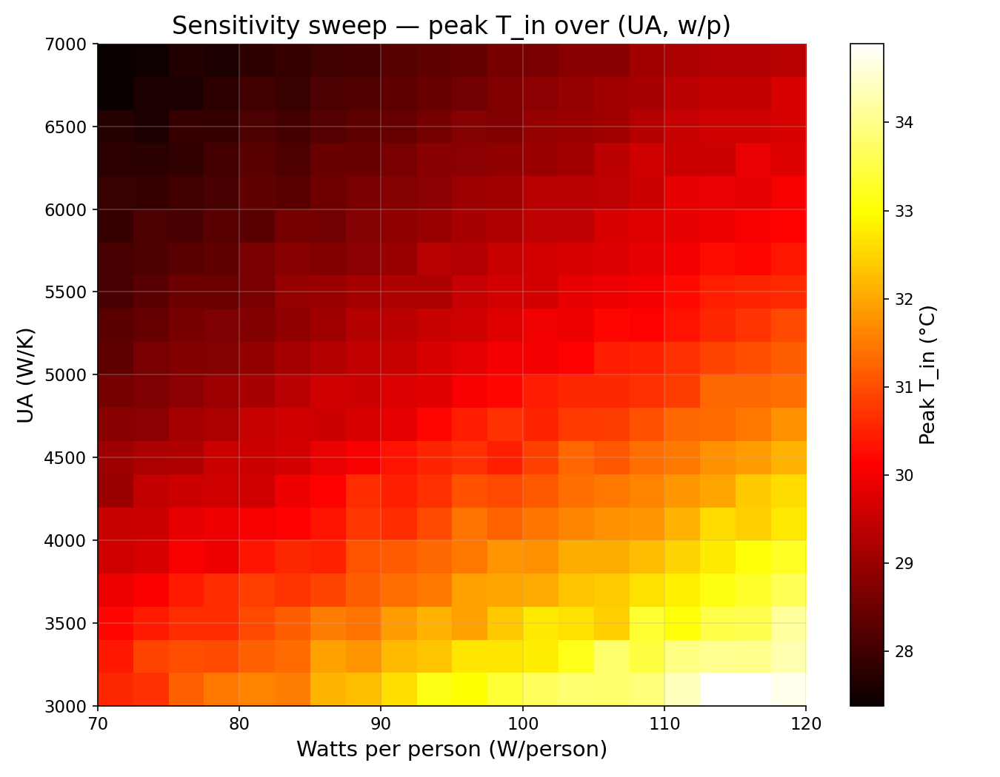
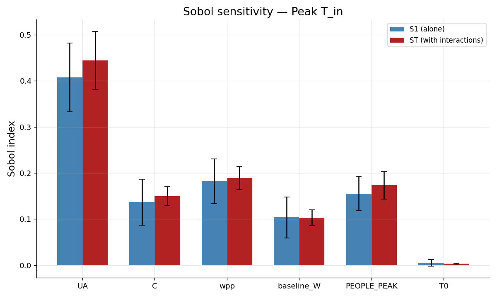
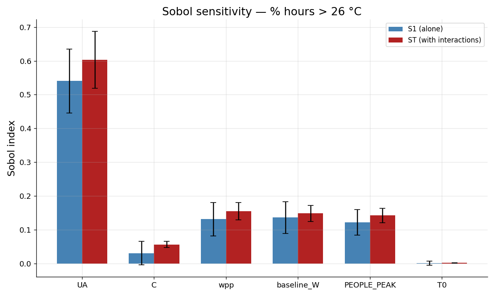

# Energy Twin

HVAC sensitivity & optimization toolkit for metro stations. Public data only.

## What this is

Early-stage data foundation. Currently: weather data pipeline, exploratory analysis on 30 years of Paris hourly weather, a thermal model layer driven by that weather and by real RATP occupancy data, a first 2D sensitivity sweep on envelope and load parameters, and a quantitative Sobol sensitivity analysis on 6 parameters across 2 metrics. The longer-term goal is a Python toolkit for HVAC sensitivity analysis and regulation optimization on metro stations, using only public data sources (Open-Meteo, Météo-France, IDFM, RATP, RTE, ADEME).

## Findings

### Monthly mean temperature, 1996–2025


30 sinusoidal cycles over 30 years — the seasonal signal dominates. Notable outliers: hot summer of 2003 (European heatwave), cold winter of 2010, and a cluster of warm summers in the 2020s.

### Yearly cycle, 30 years overlaid


Each line is one year, colored from blue (1996) to red (2025). Winter months show wider year-to-year spread than summer. Recent years (red) bias toward the upper edge of the summer envelope — the warming signal showing up on a seasonal view.

### Average daily cycle


Averaged over 30 years: minimum at 5–6 AM (~8.7 °C), maximum at 2–3 PM (~15.4 °C). Diurnal swing of ~6.7 °C.

### Yearly mean temperature trend


Linear regression on annual means: **+0.48 °C/decade**, p = 0.0002. Statistically significant warming, consistent with reported Western European trends. 30 data points, one per year.

### Temperature vs relative humidity


Moderate inverse correlation (r = -0.58). Cold air clusters at high humidity; hot air spans a wide humidity range. The shape of the cloud reflects Clausius-Clapeyron — air's water-holding capacity rises ~7%/°C, so at low temperatures even small amounts of water vapor saturate the air, while warm air can be dry. Directly relevant to HVAC dehumidification load: summer cooling is also water removal.

### Occupancy data — Pôle La Défense

Source: RATP open data, "Fréquentation du pôle La Défense" CSV from [data.iledefrance.fr](https://data.iledefrance.fr/explore/dataset/frequentation-du-pole-de-la-defense-experimentation-de-lissage-des-heures-de-poi/), entries on the corridor of Pôle La Défense.

Pre-processing pipeline (Excel-side, before the Python project picks it up):

1. **Filter to post-COVID years** to remove the pandemic anomaly from the typical-day signal.
2. **Group by day-type and hour**, compute the mean count for each: JOHV (working day, school in session), JOVS (working day, school holidays), SA (Saturday), DIJFP (Sunday + public holidays).
3. **Merge SA and DIJFP into WKD** (weekend) by taking the hourly maximum across the two columns. We want the envelope of weekend traffic, not the average — sizing on the busier of the two.
4. **Normalise** by setting the highest value of the dataset (JOHV at 18h) as 100%. All other cells become percentages of that peak. The resulting profile is dimensionless.
5. **Calibrate to absolute headcount** by anchoring 100% to **400 persons** in the studied corridor. Multiplying the percentage profile by 400 gives an instantaneous headcount.

Result: three normalised hourly profiles (JOHV, JOVS, WKD), 24 values each, in `data/raw/Defense_Occupation_Normalised.xlsx`. Read by `occupancy.py`.

### Thermal model — first week of July 2024


Lumped-capacitance model of one metro station zone — `C·dT_in/dt = UA·(T_ext - T_in) + Q_internal` — driven by real Paris weather and real RATP occupancy. The synthetic square-wave Q from the previous version is gone; Q is now computed from the headcount profile:

`Q(t) = n_people(t) × 100 W/person + 10 kW (lighting + equipment baseline)`

Project scope is July 2024, so weekdays are dispatched to JOVS (summer school holidays) and Saturday/Sunday to WKD.

Three panels, top to bottom: T_ext vs T_in, Q internal, headcount n. Five weekday peaks at 18h (~395 people, ~50 kW) and two flatter weekend humps at 17h (~340 people, ~43 kW) are clearly visible.

The three behaviors from the synthetic version still hold:
- **Offset.** T_in sits ~3 °C above T_ext at peak — `Q/UA = 50000/5000 = 10 °C` is the theoretical maximum offset, damped down by thermal inertia.
- **Lag.** T_in peaks ~5 h after T_ext, consistent with `τ = C/UA ≈ 2.8 h`.
- **Damping.** T_in is markedly smoother than the occupancy spikes — the thermal mass low-pass-filters the load.

Compared to the synthetic version, peak T_in is ~5 °C higher (50 kW vs 20 kW peak Q). Parameters (UA, C) remain order-of-magnitude estimates, **not calibrated**.

### Sensitivity sweep — UA × watts per person


400 thermal model runs over the same week of July 2024, sweeping two parameters:
- **UA** (envelope conductance) from 3000 to 7000 W/K — ±40% around the baseline of 5000 W/K.
- **Watts per person** from 70 to 120 W — covering seated to active occupancy.

Each pixel is one full simulation; the color is the peak T_in reached during the week.

Findings:
- Peak T_in ranges from ~28 °C (high UA, low w/p — leaky envelope, light load) to ~35 °C (low UA, high w/p — sealed envelope, heavy load). A ~7 °C spread across realistic parameter ranges.
- The gradient is **diagonal**, not horizontal or vertical — both parameters contribute to the peak temperature response. The relative weights of each are not readable from a 2D heatmap alone; the Sobol analysis below quantifies them properly.
- Under the operational case (w/p = 100, UA = 5000), peak T_in lands around 31 °C — consistent with a buried, unventilated station in summer. The model's ~30 °C July peak is physically plausible without active cooling.

### Sobol sensitivity analysis — 6 parameters, 2 metrics

Quantitative variance-based sensitivity analysis on the thermal model. Six inputs swept simultaneously across realistic ranges:

| Parameter | Range | Meaning |
|---|---|---|
| UA | 3 000 – 7 000 W/K | envelope conductance |
| C | 2.5e7 – 7.5e7 J/K | thermal capacitance |
| wpp | 70 – 120 W/person | sensible heat per occupant |
| baseline_W | 5 000 – 15 000 W | lighting + equipment baseline |
| PEOPLE_PEAK | 300 – 500 persons | calibration anchor for the occupancy profile |
| T0 | 18 – 28 °C | initial indoor temperature |

Saltelli sampling with N = 512 → **7168 ODE solves**, ~74 s on laptop. Two metrics computed per run: peak T_in and % hours T_in > 26 °C. SALib computes first-order (S1) and total-order (ST) Sobol indices, plus 95% confidence intervals via bootstrap.

**Peak T_in**


**% hours T_in > 26 °C**


Findings:
- **UA dominates both metrics.** ST = 0.43 on peak, ST = 0.59 on hot-hour fraction. Envelope conductance is the single biggest lever — roughly 2× any other input. Implication: the most defensible engineering effort, in terms of energy/comfort outcome, is on building envelope before tuning loads.
- **Model is additive.** S1 ≈ ST for every parameter, all 15 second-order indices are statistically indistinguishable from zero. No meaningful pairwise interactions on this window. The diagonal gradient seen in the (UA, w/p) heatmap reflected two strong but independent first-order effects, not interaction.
- **C matters for peaks but not for hot hours.** C contributes ST = 0.15 on peak T_in but collapses to ST = 0.05 on % hours > 26 °C. Thermal mass smooths and delays the peak; it does not change how often the system sits in a hot regime once the load profile is fixed.
- **T0 is noise.** Both S1 and ST below their confidence intervals on both metrics. Initial conditions fade out within a few thermal time constants (~2.8 h here) and are irrelevant for weekly statistics.
- **The occupancy load splits across two parameters.** wpp and PEOPLE_PEAK have similar ST (~0.18 on peak) — both scale the heat load, the variance allocates roughly evenly between them.

This Sobol analysis closes the visual sweep from the previous section by ranking the inputs quantitatively. Next direction: introduce regulation parameters (setpoints, airflow_min, deadbands) so sensitivity analysis can speak to control strategy, not just envelope/load characterisation.

## Data

- **Open-Meteo Historical Weather API** (ERA5 reanalysis), 30 years of Paris hourly weather (1996–2025). Variables: 2 m temperature, 2 m relative humidity. Raw CSV not committed (`.gitignore`).
- **RATP — Fréquentation du pôle La Défense** (Île-de-France Mobilités open data). Filtered to post-COVID years, aggregated to hourly profiles by day-type, normalised on JOHV-18h = 100%. Processed file tracked in the repo: `data/raw/Defense_Occupation_Normalised.xlsx`.

## Scripts

- `fetch_weather.py` — pulls 30 years of hourly Paris weather from the Open-Meteo API, saves to `data/raw/paris_weather.csv`.
- `inspect_weather.py` — loads the CSV, prints shape, dtypes, summary stats, missing values.
- `plot_weather.py` — generates the 5 weather plots into `images/`.
- `occupancy.py` — reads the RATP normalised profiles, builds `(Q_array, n_people)` from a datetime index. Used by `thermal_model.py`, `sweep.py`, and `sobol.py`.
- `utils.py` — shared functions: `load_data`, `dT_dt` (thermal ODE slope), `style_axes` (matplotlib styling helper).
- `thermal_model.py` — single-run lumped-capacitance ODE driven by the weather CSV and `occupancy.py`. Three-panel plot saved to `images/thermal_model.png`.
- `sweep.py` — 20×20 sensitivity sweep on (UA, watts_per_person), heatmap saved to `images/sweep_heatmap.png`.
- `sobol.py` — Sobol global sensitivity analysis on 6 parameters via SALib, two output metrics, bar charts saved to `images/sobol_peak.png` and `images/sobol_pct.png`.

## Setup

```bash
git clone https://github.com/henrynasr/energy-twin
cd energy-twin
python -m venv .venv
.venv\Scripts\activate          # Windows
pip install -r requirements.txt
python fetch_weather.py         # run this first — pulls the data
python inspect_weather.py
python plot_weather.py
python thermal_model.py
python sweep.py
python sobol.py
```

## Status

Week 1 — local environment, data pipeline, weather plots, thermal model with real RATP occupancy profiles, 2D sensitivity sweep, and Sobol global sensitivity analysis (6 parameters, 2 metrics). Next: regulation layer (setpoint, airflow modulation, deadbands) so sensitivity and optimization can speak to control strategy.
