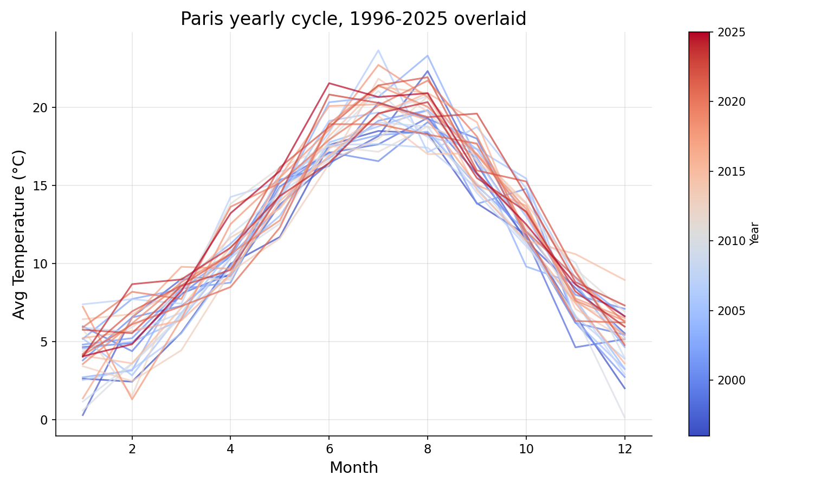
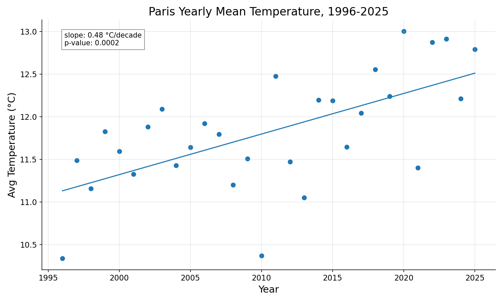
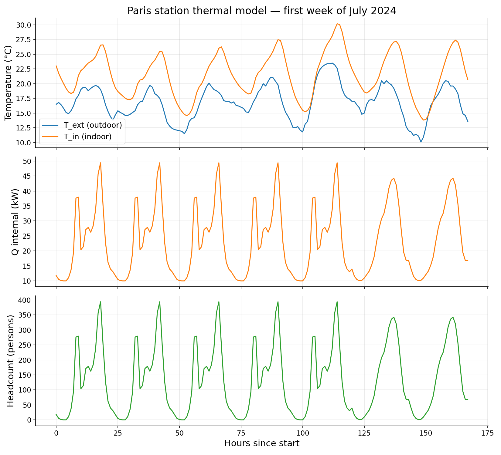

# Energy Twin

HVAC sensitivity & optimization toolkit for metro stations. Public data only.

## What this is

Early-stage data foundation. Currently: weather data pipeline, exploratory analysis on 30 years of Paris hourly weather, and a first thermal model layer driven by that weather. The longer-term goal is a Python toolkit for HVAC sensitivity analysis and regulation optimization on metro stations, using only public data sources (Open-Meteo, Météo-France, IDFM, RTE, ADEME).

## Findings

### Monthly mean temperature, 1996–2025


30 sinusoidal cycles over 30 years — the seasonal signal dominates. Notable outliers: hot summer of 2003 (European heatwave), cold winter of 2010, and a cluster of warm summers in the 2020s.

### Yearly cycle, 30 years overlaid


Each line is one year, colored from blue (1996) to red (2025). Winter months show wider year-to-year spread than summer. Recent years (red) bias toward the upper edge of the summer envelope — the warming signal showing up on a seasonal view.

### Average daily cycle


Averaged over 30 years: minimum at 5–6 AM (~8.7 °C), maximum at 2–3 PM (~15.4 °C). Diurnal swing of ~6.7 °C.

### Yearly mean temperature trend


Linear regression on annual means: **+0.48 °C/decade**, p = 0.0002. Statistically significant warming, consistent with reported Western European trends. 30 data points, one per year.

### Temperature vs relative humidity


Moderate inverse correlation (r = -0.58). Cold air clusters at high humidity; hot air spans a wide humidity range. The shape of the cloud reflects Clausius-Clapeyron — air's water-holding capacity rises ~7%/°C, so at low temperatures even small amounts of water vapor saturate the air, while warm air can be dry. Directly relevant to HVAC dehumidification load: summer cooling is also water removal.

### Thermal model — first week of July 2003


A first-pass lumped-capacitance model of a metro station: one zone, one indoor temperature `T_in(t)`, energy balance `C·dT_in/dt = UA·(T_ext - T_in) + Q_internal`. Driven by real Paris weather and a synthetic day/night occupancy load (square wave: 20 kW peak 7h–22h, 5 kW at night). Integrated with `scipy.integrate.solve_ivp`.

Three behaviors visible and physically correct:
- **Offset.** T_in sits above T_ext by `Q/UA` (~3 °C peak, ~1 °C night) — internal gains lift the equilibrium.
- **Lag.** T_in peaks ~5 h after T_ext, consistent with the time constant `τ = C/UA ≈ 2.8 h`.
- **Damping.** T_in is smoother than T_ext — the station acts as a low-pass filter on outdoor variation.

Parameters (UA, C, Q) are plausible orders of magnitude, **not calibrated**. The point of this stage is to validate the dynamics, not the absolute numbers.

## Data

Open-Meteo Historical Weather API (ERA5 reanalysis), 30 years of Paris hourly weather (1996–2025). Variables: 2 m temperature, 2 m relative humidity. Raw CSV not committed (`.gitignore`).

## Scripts

- `fetch_weather.py` — pulls 30 years of hourly Paris weather from the Open-Meteo API, saves to `data/raw/paris_weather.csv`.
- `inspect_weather.py` — loads the CSV, prints shape, dtypes, summary stats, missing values.
- `plot_weather.py` — generates the 5 weather plots into `images/`.
- `thermal_model.py` — lumped-capacitance ODE driven by the weather CSV, plot saved to `images/thermal_model.png`.

## Setup

```bash
git clone https://github.com/henrynasr/energy-twin
cd energy-twin
python -m venv .venv
.venv\Scripts\activate          # Windows
pip install -r requirements.txt
python fetch_weather.py         # run this first — pulls the data
python inspect_weather.py
python plot_weather.py
python thermal_model.py
```

## Status

Week 1 — local environment, data pipeline, 5 weather plots, first thermal model layer. Next: replace synthetic occupancy with real IDFM validations data, then run a first sensitivity sweep on (UA, Q).